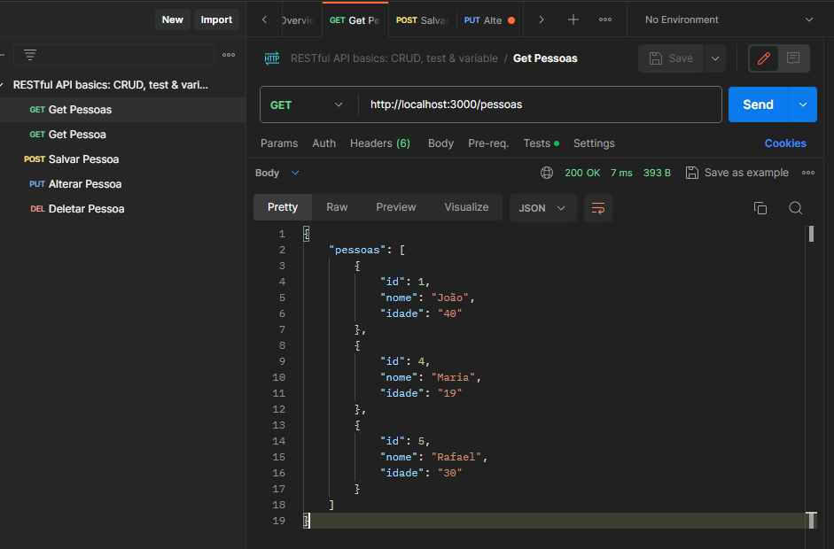

## API com Node.js e SQLite

Este projeto é uma API simples desenvolvida com Node.js utilizando o framework Express e o banco de dados SQLite para armazenamento dos dados, com o propósito de aprendizado pessoal.

## Pré-requisitos

Certifique-se de ter o Node.js instalado na sua máquina. Caso ainda não o tenha, você pode baixá-lo em [nodejs.org](https://nodejs.org/).

## Instalação
1. Clone este repositório: `git clone https://github.com/wendrellBr/API_CRUD-Node.git`
2. Acesse o diretório do projeto: `cd API_CRUD-Node`
3. Instale as dependências: `npm install`

## Configuração do Banco de Dados

Certifique-se de que o banco de dados SQLite está configurado corretamente. No projeto, o banco é criado automaticamente, mas você pode ajustar as configurações no arquivo `configDB.js` se necessário.

## Executando a Aplicação

Para iniciar a API, utilize o seguinte comando:

`npm start `

Isso iniciará o servidor HTTP na porta 3000 e o servidor HTTPS na porta 3001, conforme configurado no código.

## Endpoints da API

- `GET /`: Retorna uma mensagem indicando que a API está rodando.
- `GET /pessoas`: Retorna todas as pessoas cadastradas.
- `GET /pessoa?id={id}`: Retorna os dados de uma pessoa específica com base no ID fornecido.
- `POST /pessoa`: Cria uma nova entrada de pessoa no banco de dados.
- `PUT /pessoa`: Atualiza os dados de uma pessoa existente com base no ID fornecido.
- `DELETE /pessoa?id={id}`: Deleta uma pessoa do banco de dados com base no ID fornecido.

## Funcionamento no PostMan

## Autor

Wendrell Possato Oliveira

## Inspiração

Partes do código e a estrutura da API foram desenvolvidas com base no projeto [api-node-sqlite](https://github.com/yurimarcon/api-node-sqlite). Este projeto serve como inspiração e referência, sendo adaptado e personalizado para fins educacionais, visando aprofundar o entendimento sobre o desenvolvimento de APIs com Node.js e SQLite.

## Licença

Este projeto está licenciado sob a Licença MIT - veja o arquivo [LICENSE](./LICENSE) para mais detalhes.
